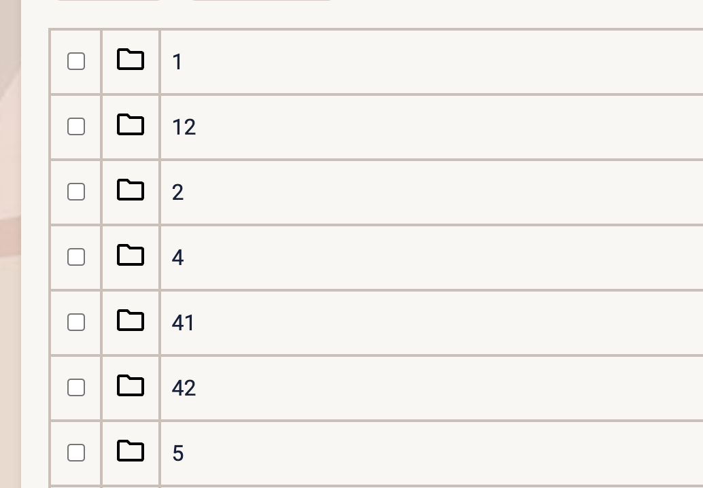

# Quilt Labs - Notes Filesystem App Challenge

## Running the code

1. If you don’t have it please install [node.js and npm](https://docs.npmjs.com/downloading-and-installing-node-js-and-npm).
2. Run `npm install` in the project directory.
3. Run `npm run dev` in the project directory.
4. The app should now be running on `localhost:3030` so put that into your web browser and try it out.

## Provided code

**Items**

An **Item** can be either a **Note** or a **Directory**. A **Note** is a leaf node in the filesystem and contains a string of text. A **Directory** is a node in the filesystem that can contain other **Items**. The root of the filesystem is a **Directory**.

Schema:

| **Field** | **Type**              | **Description**                                                                                     |
| --------- | --------------------- | --------------------------------------------------------------------------------------------------- |
| type      | ‘note’ \| ‘directory’ | Defines whether an Item is a Note or Directory.                                                     |
| name      | string                | The name associated with the Item.                                                                  |
| parent    | Item \| undefined     | A reference to the parent of this Item. undefined for the `root` directory.                         |
| note      | string \| undefined   | The actual notes text that the user can set for `Note` items. undefined when `type == ‘directory’`. |
| items     | Item[] \| undefined   | The items in this directory if the item is a `Directory`. undefined when `type == ‘note’`.          |

This is defined in `app/components/types.ts`.

**Components**

- `ReactApp (app/components/reactApp.tsx)` - The main component that renders the app.
- `Workspace (app/components/workspace.tsx)` - The component that renders the filesystem.
  - This component provides a `React.Context` through which child components can filesystem methods and state.
- `ItemView (app/components/workspace.tsx)` - The component which renders an individual Item.
  - This component checks the type and renders the correct component for the Item type (Note or Directory).
- `noteView (app/components/noteView.tsx)` - The component which renders a Note.
- `directoryView (app/components/directoryView.tsx)` - The component which renders a Directory.
  - This component renders the the correct number of Table Rows in TableView
- `pathView (app/components/pathView.tsx)` - The component which renders the Path.
- `renameBox (app/components/renameBox.tsx)` - the component which renders an individual rename input box for the Table
- `tableView (app/components/tableView.tsx)` - The component renders the table
  - This component checks the type and renders the correct SVG

**React Context**

The `Workspace` component provides a `React.Context` through which child components can filesystem methods and state. This is defined in `app/components/workspace.tsx`.

| **Field**       | **Type**       | **Description**                                                                            |
| --------------- | -------------- | ------------------------------------------------------------------------------------------ |
| currentItem     | Item \| null   | The current item rendered in the `Workspace`.                                              |
| setCurrentItem  | Function       | Sets the current item to a different item.                                                 |
| addNote         | Function       | Creates a new note given a `fileName` and `noteText`, if the `currentItem` is a directory. |
| addDirectory    | Function       | Creates a new directory given a `newDirName`, if the `currentItem` is a directory.         |
| updateNote      | Function       | Updates the `note` text of the `currentItem`, if it is a note.                             |
| deleteDirectory | Function       | Filters out the `items` in `currentItem` if the hashmap includes the names of the item     |
| updateName      | Function       | Updates the `name` text of the `currentItems`                                              |
| selectBoxes     | String[]\|null | The current checkboxes that are checked                                                    |
| setSelectBoxes  | Function       | Adds new boxes that are checked to the selectBoxes state                                   |

**Questions**

If there are any questions or issues about the starter code, please reach out to `support@quiltlabs.ai` and we will respond ASAP. Good luck!

## Thoughts and Journey

**Deleting Items**

I decided to go down the requirement one at a time. I started with Deleting items. Before actually working on the code, I took approximately one hour looking through the code trying to understand it. First things I've noticed was that some hooks were foreign to me. I've never used useContext before and learning to use that really changed the way I thought about using props. I decided to avoid continue the structure by trying to keep all the functions that required using setCurrentItem to be written in the workspace.tsx and then using useContext in the smaller components.

The first small issue I ran into was when an item with the name "a" was filtered out and deleted, the next time I created an item with the exact name, the checkbox would be automatically checked off. This was because I didn't actually make a checked attribute that defaulted to false so I think it saved the previous state somewhere. I solved this issue by using a selectedBox state and made the checkbox check to see if selectedBox includes the name and if not, it will default to false. SelectedBox gets reset back to an empty array after successfully deleting files.

**Renaming Items**

In order to do the renaming part, I conditionally rendered the filename cell of the table. If the state is isRenaming then the cell becomes an input box with the filename filled in and if the state is not isRenaming then the cell will be only be rendering text.

One issue I faced during this part was that since the isRenaming state changes all the cells to an input box, I want the user to be able to change multiple names at the same time. It would be extremely annoying if the user only had the option to change the names one at a time if they needed to change multiple ones. I initially had it so when the user presses "enter", the box that they were typing in would update. I later changed it to include a submit button instead that loops through all of the items and updates it if there are any changes

Another issue was the logic to find if the user is renaming a file to an existing name. I am currently using a nested for loop to check if any of the new names match any of the original names excluding the file iteself (this is because we don't want to force the user to have to change their filename). This is extremely inefficient because the time complexity if O(n^2) and can slow down the whole application when it increases. One way to improve this might be trying to use a hashmap again because using .has() is O(1) time complexity. If I had more time, I would try to implement this.

**Sorting**

The one issue with sorting is that I was debating whether I should consider the numbers in the fileNames to be integers or just strings. An example of this is:

Should I consider 12 to be the number 12 or should I consider it as "1" + "2". In the sorting that I'm currently using, 12 is not an integer so it will be placed between 1 and 2. That was something I was debating on which is the best practice. I created a function for sorting and called it at the end of each function that changed the currentItem.

**Unique Filenames**

Unique filename was implemented by simply looping through the currentItem and checking to see if there's an item with the inputted name from the window.prompt. If there is, I would just alert the user that it already exists and I would return the function. I added this handleAddNote and handleAddDirectory. I would end the function before it even calls the function in workspace that changes the currentItem if the filename already exists.

**Pathing**

Pathing was done in pathView.tsx. What I did was as long as currentItem exists, I would initially set a pointer to currentItem and then use a while loop to keep going through currentItem.parent until it didn't exist. As I'm going through, I'm pushing the parent node to an array. I will simply render the array when it finishes. The one additional step that I had to do was reverse the array because it looks like when the array is actually being rendered, each element of the array is being prepended to the front.

I also added a yellow highlight to the current root the user is on and also added a folder svg or a note svg to show the user which type of item they are current in. I remove the current directory and type text that was previously there. I felt like having a yellow highlight is already clear enough for the user to see which directory they are in.

**Styling**

Finally, styling definitely took a bit of time. I added a new name to the website calling it Notee. I didn't know this because Notee is french for noted and this app is kind of like a notetaking application so i thought the name fits pretty well. I wanted the whole website to be clean and not cluttered with random stuff. I wanted the colors to work together and didn't have big contrast in the website. I added a conditional hover color depending on whether the mouse is currently hovering on a note or a directory (although the color is not drastically different). All the buttons also have a different hover color and the cursor changes to help give the user a signal that they are clicking on a button. I also made a few conditional renders, for example, when we are in the Renaming state, some buttons such as the new Note, new Directory, and delete buttons disappear until they are done renaming.

## TLDR

**Issues**

First main issue was deleting. I created a input checkbox in each row of the table and will delete the items based on whether or not the checkbox is checked. The issue I ran into was that I initially didn't have a checked attribute in my checkbox so I could never change the state through code. The items would get deleted and the next time, the item was created with the same name, the checkbox would automatically be checked. This was something that I definitely needed to fix because that might cause the user to accidentally delete files that they didn't intend on deleting.

I fixed the problem by adding a checked attribute and adding a conditional check to see if the state selectedBoxes has name associated with the checkbox. If it does not then it will automatically be false. The selectedBoxes state is automatically set to an empty array after successfully deleting so all checkboxes should be unchecked when first created.

Second issue that I faced was renaming items in the current directory. Previously, renaming would only work on a single input box even though the entire column childItem.name was changed from text to input cell. That was very misleading. Furthermore, I only allowed the user to rename by clicking enter on the keyboard without any directions. This could lead to the users feeling confused and frustrated so I re-did the feature by adding a submit button instead and remove the 'enter' keydown event. I also made it so the user can change all of the file names they want. Since the currentItems.item and the table rows are in the exact order, I can easily just loop through the currentItem.item and replace it with the new item names.

**Additional Features/ Changes**
From what I mentioned above, one thing that I definitely need to fix is the nested for-loops in handleNameSubmit. I might be able to use a hashmap and use the has() function for a quicker lookup. Having a O(n^2) complexity will slow down the application if there are too many notes in the future.

In one of the interfaces I used an any type for setSelectBoxes. I would never use any type if I had additional time to figure out why it was causing an error. I tried using string[] but it was throwing an error. The SelectBoxes state is initialized to [] and should always be string[]. However, when I try to use box: string[] it throws an error at me and I was working to fix it but didn't have enough time.

I tried to think of all the edge cases I could for all the features but there is definitely some that I probably missed. However, I definitely tried to account for edge cases using if statements or by simply rendering buttons out that don't make sense to be there.

I actually wanted to add a preview to the main directoryView. Right now, the directoryView only displays the name of the file. However, I think it might be useful to display a slice of the notes to give the user an idea on what's inside the specific note.

I also want to make the noteView a bit better. Currently the textarea doesn't look as clean as it could. I want the the transition to isEditing to be as seamless as possible.

Another stylistic adjustment is table when the user is renaming. I might be better to remove the first column that is completely empty.

**Overall**

Overall, it was a tiring but great experience. This was my first take-home assignment and I honestly had a great time making the application. I learned a lot during these past 3 days working with Next.JS, React, and TypeScript. I greatly appreciate this opportunity to show my skills. If possible, I would love some feedback on how I did and what I can improve on. I look forward to hearing back from you guys! Thank you so much!
