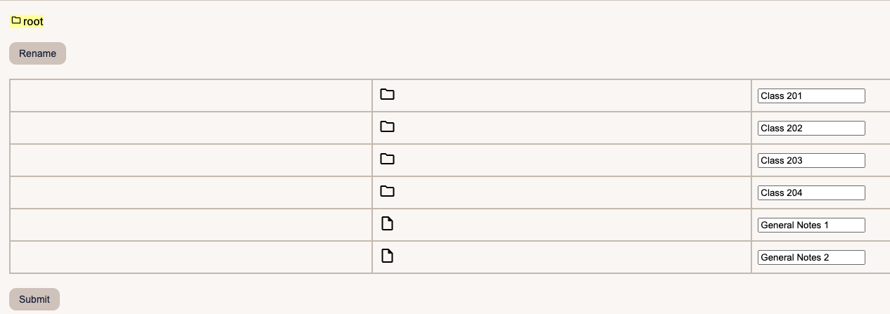

<h1 align='center'>
Notee
</h1>
<h4 align='center'>
Notee allows users to write and edit notes as well as create directories/folders for different topics.
  

Main Page

Rename Function 

Notes

Path

</h4>

## Running the code

1. If you don’t have it please install [node.js and npm](https://docs.npmjs.com/downloading-and-installing-node-js-and-npm).
2. Run `npm install` in the project directory.
3. Run `npm run dev` in the project directory.
4. The app should now be running on `localhost:3030` so put that into your web browser and try it out.

### Features:

- Allows users to create directories/folders for different topics.
- Allow users to delete and rename directories and notes.
- Path that updates and displays the current directory/note the user is located.
- Allows users to navigate back to previous directories.
- Allows users to edit notes that was previously created.
